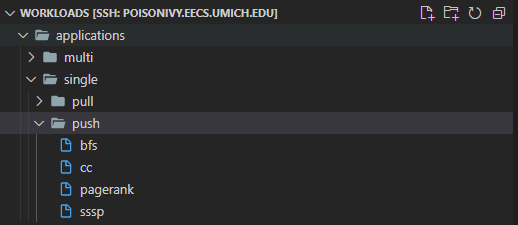
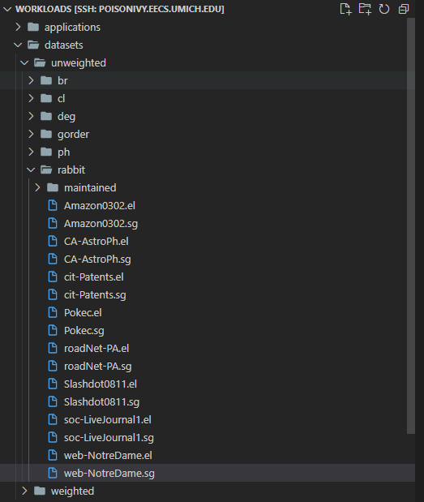

# Running Application Compile Script #
Link to file: [app_compile_runner.sh](app_compile_runner.sh)
## Input Graphit application path ##
- the graphit apps(modified versions provided in this repo to log runtime to file instead of the stdout) need to live in ```~/graphit/build/bin/graphit_apps/``` folder, including a [logger.cpp](../benchmark_applications/logger.cpp) file to log runtime to log.txt file
- the graphit schedules are assumed to live at ```~/workloads/graphit_schedules/``` could to edited to point to another location in the script as well
- 
    E.g. ```~/graphit/build/bin/graphit_apps/pagerank_benchmark_m.sg```

    ```~/materials/graphit_schedules/pull.gt```

## output directory ##
    ~/workloads/applications -- applications root path
        /single -- single or multi-threaded
            /pull -- pull, push, or push-pull
                bfs -- executable
                pagerank -- executable
                cc -- executable
                sssp -- executable
            /push
                bfs -- executable
                pagerank -- executable
                cc -- executable
                sssp -- executable
        /multi
            /pull -- pull, push, or push-pull
                bfs -- executable
                pagerank -- executable
                cc -- executable
                sssp -- executable
            /push
                bfs -- executable
                pagerank -- executable
                cc -- executable
                sssp -- executable
### Example ###



PS. This script needs to be invoked from ```~/graphit/build/bin/``` folder

# Running Reordering Script #
The reordering script heavily relies on directory structures, which have meaning for proper execution of the script.

Link to file: [reordering_runner.sh](reordering_runner.sh)

## required directory structure ##
### original graph path ###
```~/materials/sample_edgelists/original/``` --> this path should contain any graph which needs to be reordered, both weighted and unweighted versions. If not applicable, the script needs to be modified to exclude, i.e. comment the line that invokes on weighted graphs

### output directory ###

    ~/workloads -- all manipulated contents go here
        /datasets/ -- all reordered graphs
            /unweighted -- unweighted reordered graphs
                /deg -- this directory specifies the reordering method [br, ph, deg, cl, rabbit]
                    /maintained -- initial vertex maintained graphs
                        <graph-name>.el -- graph's el format
                        <graph-name>.sg -- graph's sg format
                    <graph-name>.el -- graph's el format
                    <graph-name>.sg -- graph's sg format
            /weighted -- weighted reordered graphs (initial vertex maintained by default)
                /br -- this directory specifies the reordering method [br, ph, deg, cl, rabbit]
                    <graph-name>.wel -- graph's wel format
                    <graph-name>.wsg -- graph's wsg format
### Example ###


PS. This script needs to be run from inside ~/graph-reorder

# Running Simulation in Baseline #
The baseline simulation runner script heavily relies on directory structures, which have meaning for proper execution of the script.

Link to file: [simulation_runner_baseline.sh](simulation_runner_baseline.sh)

## Inputs ##
When running benchmark applications in baseline, one can modify the script to change the benchmark applications, the scheduling directions, input graphs, and also threading options.

The Input data required are: 

    original graph root path E.g. ~/materials/sample_edgelists/original
    reorderd graph root path E.g. ~/workloads/datasets
    benchmark apps root path E.g. ~/workloads/applications

[average.py](average.py) -- averages runtimes in the temp file in milliseconds (when it's required to take average of several runs to get better approximation b/c of system load d/f at different times) & logs average to temp itself. This also needs to live in the same dir as the script

## Output ##
The runtimes (in milliseconds) for an applications and reordering methods are logged to a file in ```$output``` variable, "statistics.json" for example. The output is not a valid json format, b/c some keys are multiple workds and needs to be in quotation.

PS. This script needs to be run from inside ```~/workloads``` folder

# Running Simulation on gem5 #
gem5 environment should be set up prior running this script.

Compared to Baseline what changes in gem5 script is that it's ran on gem5 simulation environment, and proper paths to gem5 & it's configs should be provided in variables.

Linke to file: [simulation_runner_gem5.sh](simulation_runner_gem5.sh)
## Inputs ##
All inputs and setups done on baseline script are also required for gem5 simulation. Additionally, the script requires:

- gem5 executable path E.g. ```$gem5=~/gem5/build/X86/gem5.opt```
- gem5 config path E.g. ```$config=~/gem5/configs/example/se.py```
- gem5 parameters E.g. ```$params=--cpu-type=TimingSimpleCPU --num-cpus=1 --sys-clock=2GHz --caches --cacheline_size=64 --num-dirs=4 --mem-size=4GB --l1i_size=16kB --l1i_assoc=4 --l1d_size=16kB --l1d_assoc=8 --l2cache --num-l2caches=1 --l2_size=2MB --l2_assoc=8 --ruby --topology=Crossbar```

## Output ##
The runtimes (in milliseconds) for an applications and reordering methods are logged to a file in ```$output``` variable, "statistics_gem5.json" for example. The output is not a valid json format, b/c some keys are multiple workds and needs to be in quotation.

# Compling applications for OMEGA #
Read this detailed readme file on building Apps for OMEGA

# Running Simulation on OMEGA #
Compatible gem5 version should be installed on your system prior to running the script

Link to file: [simulation_runner_omega.sh](simulation_runner_omega.sh)

## Inputs ##
The below listed paths can be modified to indicate different locations of the files.
The applications are modified to log runtime into a log text, and are found in ```~/omega/benchmarks/{application_name}```
- Input graph root path E.g. ```input_path=../filtered```
- Runner script path, E.g. ```runner=gem5_run_acc.sh```
- Application root path, E.g. ```app_path=.``` (if in same directory)
- Reordered graphs' root path, E.g. ```dataset_path=../datasets```
  
## Output ##
The runtimes (in seconds) for an applications and reordering methods are logged to a file in ```$output``` variable, "statistics_omega.json" for example. The output is not a valid json format, b/c some keys are multiple workds and needs to be in quotation marks.

PS. this script needs to be run from inside ```~/path/to/omega/benchmarks``` folder, otherwise relative paths in the script should be modified to specify new file locations.


